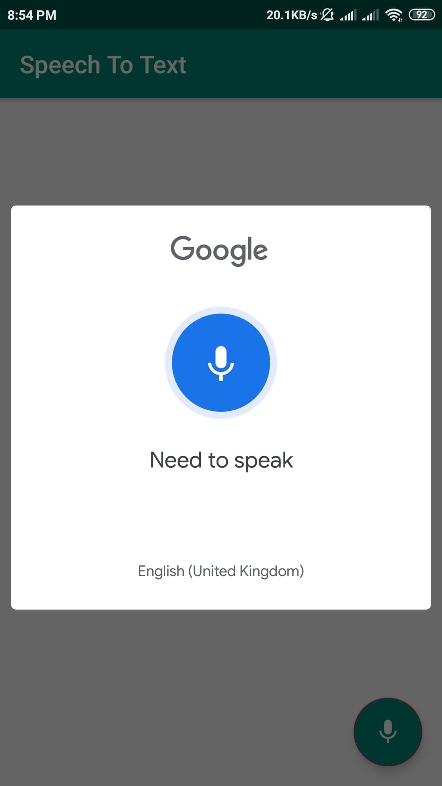
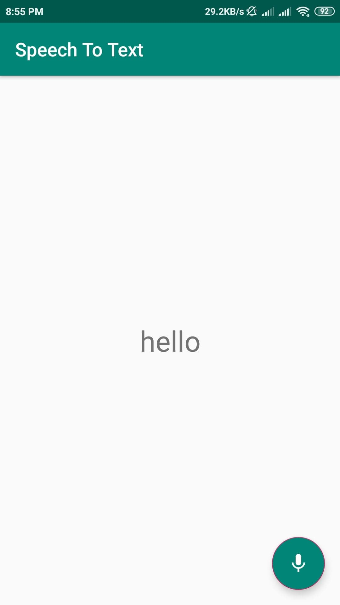

# Speech To Text

This project is for learning how to convert speech into text using google api in android app.

### Call Google API (ACTION_RECOGNIZE_SPEECH)

```java
Intent intent = new Intent(RecognizerIntent.ACTION_RECOGNIZE_SPEECH);
intent.putExtra(RecognizerIntent.EXTRA_LANGUAGE_MODEL, RecognizerIntent.LANGUAGE_MODEL_FREE_FORM);
intent.putExtra(RecognizerIntent.EXTRA_LANGUAGE, Locale.getDefault());
intent.putExtra(RecognizerIntent.EXTRA_PROMPT, "Need to speak");
try {
   startActivityForResult(intent, REQ_CODE);
} catch (ActivityNotFoundException a) {
   Toast.makeText(getApplicationContext(), "Sorry your device not supported", Toast.LENGTH_SHORT).show();
}
```

### Get Result by onActivityResult() Method

```java
@Override
protected void onActivityResult(int requestCode, int resultCode, Intent data) {
   super.onActivityResult(requestCode, resultCode, data);
   switch (requestCode) {
      case REQ_CODE: {
         if (resultCode = = RESULT_OK && null ! = data) {
            ArrayList result = data
            .getStringArrayListExtra(RecognizerIntent.EXTRA_RESULTS);
            textView.setText(result.get(0));
         }
         break;
      }
   }
}
```

### Screenshots
 &nbsp;&nbsp;&nbsp;&nbsp;&nbsp;&nbsp;&nbsp;&nbsp;
